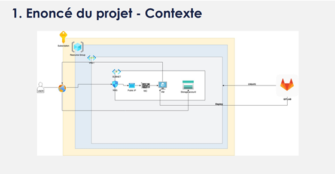
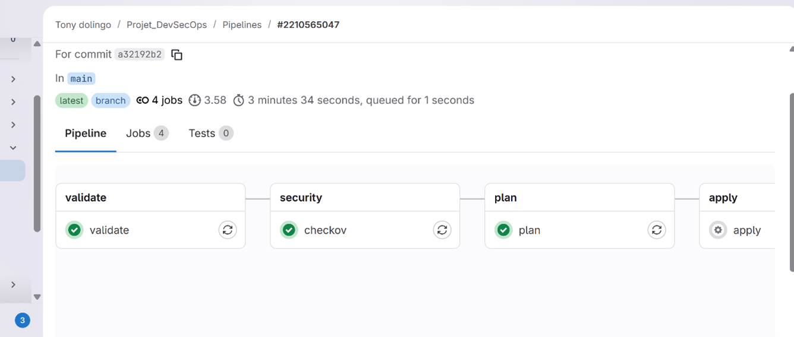
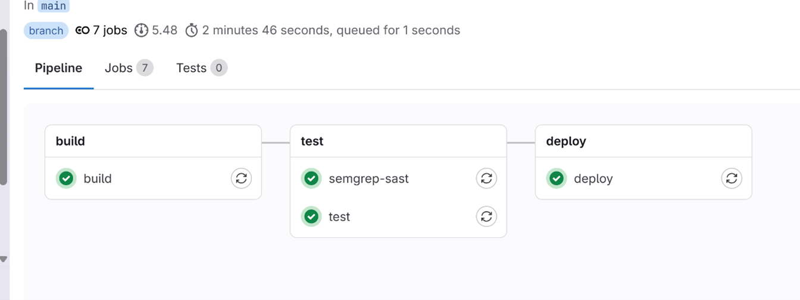

# Projet DevSecOps – CI/CD Sécurisé sur Azure avec Terraform

Déploiement d'une infrastructure cloud Azure via Terraform avec deux projets GitLab distincts (infrastructure et application), intégrant des outils de sécurité directement dans les pipelines CI/CD : Checkov, Semgrep SAST et Conftest/Rego.

---

## 1. Contexte et architecture cible



L'objectif est de reproduire cette architecture cloud Azure, déployée et gérée entièrement via GitLab CI/CD :

| Ressource | Description |
|---|---|
| Virtual Network (VNet) + Subnet | Réseau isolé `10.0.0.0/16` / `10.0.1.0/24` |
| VM Linux (Ubuntu) | Hôte de l'application Flask |
| Network Interface (NIC) + IP publique | Point d'entrée réseau de la VM |
| Network Security Group (NSG) | Règles d'accès sur les ports 22 (SSH) et 80 (HTTP) |
| Storage Account | Stockage blob contenant `message.txt` |

L'application déployée expose les données du Storage Account à l'URL :
```
http://<IP_VM>/read-file
```

---

## 2. Structure des projets GitLab

Conformément aux livrables demandés, deux projets GitLab distincts ont été créés :

### Projet 1 – Infrastructure (Terraform)
Contient le code Terraform et le pipeline CI/CD pour déployer l'infrastructure Azure.

### Projet 2 – Application (Docker + Flask)
Contient le code de l'application et le pipeline CI/CD pour déployer l'application sur la VM via SSH.

---

## 3. Stack technique

| Catégorie | Outils |
|---|---|
| Infrastructure as Code | Terraform 1.5.6 |
| Cloud | Microsoft Azure |
| CI/CD | GitLab CI/CD |
| Conteneurisation | Docker, GitLab Container Registry |
| Application | Python Flask |
| Sécurité IaC | Checkov |
| Sécurité code | Semgrep SAST |
| Policy as Code | Conftest + Rego |

---

## 4. Pipelines CI/CD

### Pipeline Infrastructure (Terraform)



```
validate ──► security (Checkov) ──► plan ──► apply (manuel)
```

| Stage | Outil | Description |
|---|---|---|
| `validate` | Terraform | `terraform init` + `terraform validate` |
| `security` | Checkov | Scan de sécurité sur tous les fichiers Terraform |
| `plan` | Terraform | Génération du plan d'exécution (`tfplan`) |
| `apply` | Terraform | Déploiement de l'infrastructure Azure — déclenchement **manuel** |

Pipeline exécuté en **3 min 34 s** — 4 jobs, branche `main`. Le stage `apply` est en `when: manual` pour éviter tout déploiement involontaire.

---

### Pipeline Application (Docker)



```
build ──► test (SAST + test) ──► deploy
```

| Stage | Outil | Description |
|---|---|---|
| `build` | Docker | Build de l'image + push vers GitLab Container Registry |
| `test` | Semgrep SAST | Analyse statique du code Python (vulnérabilités applicatives) |
| `test` | — | Validation applicative |
| `deploy` | SSH | Pull de l'image sur la VM Azure + lancement du conteneur (port 5000) |

Pipeline exécuté en **2 min 46 s** — 7 jobs, branche `main`. Les trois stages passent avec succès (✅), confirmant le déploiement automatique sur la VM Azure.

---

## 5. Analyse des risques de sécurité

> ⚠️ Les vulnérabilités documentées ci-dessous sont **intentionnelles**. Elles ont été introduites dans le code et l'infrastructure pour être détectées par les outils de sécurité, analysées et corrigées — c'est l'objectif central de l'exercice DevSecOps.

### 5.1 Vulnérabilités applicatives (Semgrep SAST)

#### 🔴 CRITIQUE — Command Injection (`/debug`)
```python
@app.route("/debug")
def debug():
    return os.popen(request.args.get("cmd", "ls")).read()
```
L'entrée utilisateur est transmise directement au système d'exploitation sans validation. Tout visiteur peut exécuter des commandes arbitraires sur la VM : suppression de fichiers, installation de malware, pivot réseau, exfiltration de données.

**Classification** : OWASP Top 10 – A03:2021 Injection

**Corrections recommandées :**
- Supprimer l'endpoint `/debug`
- Utiliser `subprocess.run(["/usr/bin/ls"], shell=False)` avec liste blanche de commandes
- Protéger la route par authentification si conservée

---

#### 🟠 ÉLEVÉ — Storage Account en accès public (`/read-file`)
```python
blob_url = f"https://{storage_account}.blob.core.windows.net/{container}/{blob}"
r = requests.get(blob_url)
```
Le blob Azure est accessible anonymement. Toute personne connaissant l'URL peut lire les données stockées — risque de fuite d'informations et de non-conformité aux bonnes pratiques Azure.

**Corrections recommandées :**
- Passer le container en mode **privé**
- Utiliser un **SAS Token** pour un accès contrôlé et temporaire
- Authentifier via Azure SDK (`DefaultAzureCredential`)

---

#### 🟡 MOYEN — Absence de timeout sur `requests.get()`
```python
r = requests.get(blob_url)  # pas de timeout
```
Risque de Denial of Service par connexions lentes bloquant les threads Flask (Slowloris).

**Correction :** `requests.get(blob_url, timeout=5)`

---

#### 🟡 MOYEN — Variables d'environnement hardcodées
```python
CONTAINER = "app-container"
BLOB = "message.txt"
```
Valeurs écrites en dur dans le code. Expose la structure interne de l'application et nécessite un redéploiement pour toute modification.

**Correction :** lire toutes les variables depuis l'environnement avec validation à l'initialisation.

---

### 5.2 Vulnérabilités infrastructure (Checkov)

| Sévérité | Ressource | Problème | Recommandation |
|---|---|---|---|
| 🔴 Critique | NSG | Port 22 (SSH) ouvert sur `0.0.0.0/0` | Restreindre à une IP fixe ou Azure Bastion |
| 🟠 Élevé | NSG | Port 80 (HTTP) sans restriction | Application Gateway + WAF |
| 🟠 Élevé | NIC | IP publique directement attachée à la VM | Supprimer l'IP publique, utiliser un load balancer |
| 🟡 Moyen | Subnet | Pas d'association explicite au NSG | Ajouter `network_security_group_id` au subnet |
| 🟡 Moyen | VM | Extensions Azure activées sans contrôle | Désactiver les extensions non nécessaires, moindre privilège IAM |

---

## 6. Recommandations et améliorations

### 6.1 Infrastructure sécurisée recommandée

- **Supprimer l'IP publique directe** sur la VM — utiliser un Application Gateway ou un Load Balancer en façade
- **Restreindre SSH** à une IP d'administration fixe, ou déployer **Azure Bastion**
- **Associer le NSG au Subnet** et non uniquement à la NIC
- **Désactiver les extensions VM** non nécessaires
- **Activer Azure Defender** pour la surveillance continue des ressources

### 6.2 Déploiement applicatif sécurisé

Éviter le déploiement via SSH direct depuis le runner GitLab. Alternatives recommandées :
- **GitLab Runner interne** déployé sur la VM (supprime l'exposition du port 22)
- **Ansible** pour l'orchestration du déploiement
- **Container Registry + script local** : la VM pull elle-même l'image sans exposition SSH

---

## 7. Implémentation sécurité dans les pipelines

### Checkov – Scan IaC (Pipeline Infrastructure)

Intégré en stage `security`, Checkov analyse tous les fichiers Terraform et bloque le pipeline en cas de configuration non conforme avant tout déploiement.

### Semgrep SAST – Analyse de code (Pipeline Application)

Intégré en stage `test`, Semgrep détecte les vulnérabilités dans le code Python (injection, accès non sécurisé, hardcoding) avant tout déploiement sur la VM.

### Conftest + Rego – Policy as Code

Règle Rego bloquant automatiquement tout déploiement exposant SSH au monde entier :

```rego
deny[msg] {
  input.resource.azurerm_network_security_rule[_].source_address_prefix == "0.0.0.0/0"
  msg = "SSH ouvert au monde : déploiement bloqué"
}
```

Cette règle implémente le principe de **shift-left security** : les contrôles de politique sont appliqués avant toute création de ressource cloud, directement dans le pipeline CI/CD.

---

## 8. Infrastructure Terraform – Ressources déployées

| Ressource Terraform | Description |
|---|---|
| `azurerm_resource_group` | Groupe de ressources Azure |
| `azurerm_virtual_network` | Réseau virtuel `10.0.0.0/16` |
| `azurerm_subnet` | Sous-réseau `10.0.1.0/24` |
| `azurerm_network_security_group` | Règles firewall (ports 22 et 80) |
| `azurerm_public_ip` | IP publique de la VM |
| `azurerm_network_interface` | Interface réseau (NIC) |
| `azurerm_linux_virtual_machine` | VM Ubuntu avec accès SSH par clé |
| `azurerm_storage_account` | Blob Storage hébergeant `message.txt` |

---

## Ce que ce projet couvre

- **Shift-left security** : contrôles de sécurité intégrés dès la phase de validation, avant tout déploiement
- **Infrastructure as Code sécurisée** : détection de mauvaises configurations Terraform avec Checkov
- **Analyse de vulnérabilités applicatives** : Command Injection, accès non authentifié, DoS, hardcoding
- **Policy as Code** : blocage automatique de déploiements non conformes via Conftest/Rego
- **CI/CD complet** : deux pipelines indépendants (infra + app) avec déploiement automatisé sur Azure
- **Remédiation** : pour chaque risque identifié, une ou plusieurs corrections concrètes sont proposées

---

## Pistes d'amélioration

### Sécurisation de l'infrastructure
- **Supprimer l'IP publique directe** sur la VM et placer un **Azure Application Gateway + WAF** en façade
- **Déployer Azure Bastion** pour remplacer l'accès SSH public sur `0.0.0.0/0`
- **Segmenter le réseau** : subnet public (Application Gateway) + subnet privé (VM) en DMZ
- **Activer Azure Defender for Cloud** pour la surveillance continue et la détection de menaces

### Sécurisation du déploiement
- **Supprimer le déploiement via SSH direct** depuis le runner GitLab
- Remplacer par un **GitLab Runner auto-hébergé sur la VM** : la VM exécute elle-même ses déploiements, le port 22 n'est plus exposé publiquement
- Ou utiliser **Azure Container Apps / Kubernetes (AKS)** pour un déploiement natif cloud sans SSH

### Sécurisation de l'application
- **Corriger la Command Injection** : supprimer `/debug` ou remplacer `os.popen()` par `subprocess.run()` avec liste blanche
- **Sécuriser l'accès au Storage Account** : passer en accès privé + authentification via `DefaultAzureCredential` (Azure SDK)
- **Ajouter un timeout** sur toutes les requêtes HTTP externes
- **Valider les variables d'environnement** à l'initialisation de l'application

### Enrichissement des pipelines CI/CD
- **Trivy** : scan de vulnérabilités dans l'image Docker avant déploiement
- **OPA/Conftest** : étendre les règles Rego pour couvrir plus de cas (storage public, extensions VM, etc.)
- **Notifications Slack/email** en cas d'échec de sécurité dans le pipeline
- **Environnements séparés** : pipeline dev → staging → production avec approbation manuelle entre chaque étape